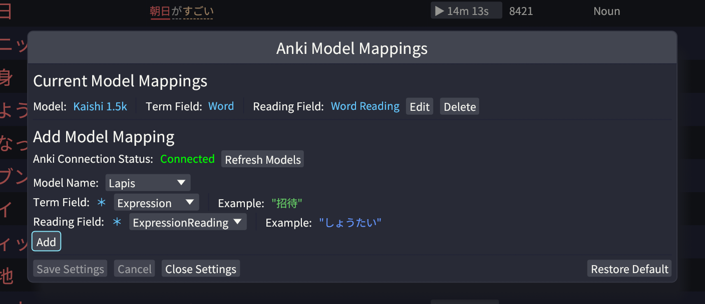

<p align="center">
    
</p>

<div align="center"> 

[](https://github.com/mcgrizzz/Yomine/actions/workflows/test.yml)
[](https://github.com/mcgrizzz/Yomine/releases)
[](https://github.com/mcgrizzz/Yomine?tab=Apache-2.0-1-ov-file)
[](https://github.com/mcgrizzz/Yomine?tab=MIT-2-ov-file)

</div>

# Yomine

A Japanese vocabulary mining tool designed to help language learners extract and study words from subtitle files. It integrates with asbplayer for timestamp navigation, ranks terms by frequency, and supports Anki integration to filter out known words. 

Written in Rust 🦀

<div align="center">
    


</div>

---

## Status

🚧 **This project is under active development and may be buggy.**  
The macOS and Linux binaries have not been extensively tested.

## Quick Start

1. **Download** the latest release for your platform from [Releases](https://github.com/mcgrizzz/Yomine/releases)
2. **Download Frequency Dictionaries** - [Frequency Dictionaries](#setting-up-frequency-dictionaries)
3. **Connect to Anki** - [Anki Setup](#setting-up-anki-integration)
4. **Connect to ASBPlayer** - In ASBPlayer, `MISC` -> `Enable WebSocket client`.

That's it! Yomine will segment the text, rank terms by frequency, and show you vocabulary and expressions to learn.

## Features

- **Vocabulary extraction** from Japanese subtitle files (words and expressions)
- **Frequency-based ranking** to prioritize terms  
- **Anki integration** to filter out words you already know
- **ASBPlayer integration** for video navigation
- **Term analysis** with readings, part-of-speech, and context sentences
- **Multi-sentence browsing** to see multiple example sentences per term
- **Ignore list** to hide unwanted terms from your mining results

## Installation

### Download Prebuilt Binary (Recommended)

1. Go to [Releases](https://github.com/mcgrizzz/Yomine/releases)
2. Download the appropriate file for your system:
   - **Windows**: `yomine-*-windows-x64.exe`
   - **macOS**: `yomine-*-macos-universal` (Intel & Apple Silicon)
   - **Linux**: `yomine-*-linux-x64`
3. Run the executable

## Configuration

### Setting Up Frequency Dictionaries

Yomine uses frequency dictionaries to rank vocabulary by importance and improve text segmentation.

**Adding Dictionaries:**
1. In Yomine, go to **File → Load New Frequency Dictionaries**
2. Select zip files containing Yomitan-compatible frequency dictionaries
3. Restart when prompted

**Recommended Dictionaries:**
- **[JPDB v2.2 Frequency Kana](https://github.com/Kuuuube/yomitan-dictionaries/?tab=readme-ov-file#jpdb-v22-frequency-kana-recommended)**: **★ If you only add one, add this one. ★**
- **[BCCWJ](https://github.com/Kuuuube/yomitan-dictionaries/?tab=readme-ov-file#bccwj-suw-luw-combined)**: Based on the Balanced Corpus of Contemporary Written Japanese
- **[CC100](https://drive.google.com/file/d/1_AYh1VtCq0cj1hXtFO15zRuPUUhUCSHD/view?usp=sharing)**: List from Common Crawl data

More dictionaries: [Marv's collection](https://drive.google.com/drive/folders/1xURpMJN7HTtSLuVs9ZtIbE7MDRCdoU29) and [Shoui's collection](https://drive.google.com/drive/folders/1g1drkFzokc8KNpsPHoRmDJ4OtMTWFuXi)

**Note**: Always download frequency dictionaries from trusted sources to avoid corrupted or malicious files. If you can't find a specific dictionary, consider generating your own using tools mentioned in Yomitan's documentation or community guides. You may want to ask around on the [TMW Discord](https://learnjapanese.moe/join/) as well.

### Setting Up Anki Integration

Yomine connects to Anki to filter out terms you already know.

**Prerequisites:**
1. Install the [AnkiConnect](https://ankiweb.net/shared/info/2055492159) add-on in Anki
   - In Anki: Tools → Add-ons → Get Add-ons → Enter code `2055492159`
   - Restart Anki

**Configuration:**
1. In Yomine: Settings → Anki Settings
2. Wait for connection to establish
3. For each note type:
   - Select from dropdown
   - Choose **Term Field** (Japanese word/phrase)
   - Choose **Reading Field** (pronunciation)
   - Click "Add" to save mapping
   
   *Note: Yomine will try to guess the correct fields for you*



### **Configuring WebSocket Connection**

Yomine uses WebSocket to communicate with ASBPlayer for timestamp navigation.

**Default Setup:**
- Yomine runs WebSocket server on port `8766`
- In ASBPlayer: `MISC` → `Enabled WebSocket Client`

**Changing the Port:**

1. In Yomine: Settings → WebSocket Settings
2. Change the port to something else (8767, 8768, 1111, 5353, etc)
3. Click "Save and Restart Server"
4. In ASBPlayer: `MISC` → `WebSocket Server URL` → enter `ws://localhost:YOUR_PORT`

### **Managing Your Ignore List**

The ignore list lets you hide terms you don't want to see from your mining results.

**Adding Terms to Ignore List:**
1. Right-click any term in the main vocabulary table
2. Select "Add to Ignore List"
3. The term will be hidden from future mining sessions

**Managing the Ignore List:**
1. Go to Settings → Ignore List Settings
2. View all ignored terms in the list
3. Remove terms by clicking the red "x"

## **Roadmap**

### Completed
- [x] **Anki Integration Customization** 
- [x] **Prebuilt Binaries**
- [x] **Multi-Sentence Browsing** - View multiple example sentences per term
- [x] **Ignore List** - Hide unwanted terms from mining results

### Planned
- [ ] **Improved Segmentation**: Better text parsing and part-of-speech tagging
- [ ] **More File Types**: Support for eBooks, web pages, etc.
- [ ] **Comprehensibility Estimation**: Sentence and file-level difficulty scoring
- [ ] **Custom Frequency Lists**: Generate dictionaries from your own content
- [ ] **Advanced Filtering**: Filter by part-of-speech, frequency ranges, n+1 sentences

## FAQ

**What is vocabulary mining?** 

It's the process of extracting unknown words and expressions from native content (videos, books, etc.) to create targeted study materials. This approach focuses on vocabulary that's relevant to content you want to understand, rather than studying random word lists.

**How should I use this tool?** 

I prefer **post-input mining**: after watching a video or episode, I add it to a todo list. Then, whenever I have time, I can review the content and extract terms I want to add to my Anki mining deck. This helps me stay focused on enjoying the content while watching, knowing I can come back to mine vocabulary later.

**Yomine?** 

The name comes from 読み ("yomi" for reading) + "mine" (as in mining vocabulary).

## Building from Source

**Prerequisites**: 
- [Rust](https://www.rust-lang.org/tools/install) with Cargo
- [asbplayer](https://github.com/killergerbah/asbplayer) (optional, for timestamp navigation)
- Anki (optional, for known vocab filtering)

**Steps:**
```bash
git clone https://github.com/mcgrizzz/Yomine.git
cd yomine
cargo build --release
cargo run --release
```

## License

Yomine is licensed under [MIT](LICENSE-MIT) OR [Apache-2.0](LICENSE-APACHE)

**Author and maintainer:** [@mcgrizzz](https://github.com/mcgrizzz)

**Key Dependencies:**
* [Vibrato](https://github.com/daac-tools/vibrato) for text segmentation - [MIT](https://github.com/daac-tools/vibrato/blob/main/LICENSE-MIT) or [Apache-2.0](https://github.com/daac-tools/vibrato/blob/main/LICENSE-APACHE)
* [egui](https://github.com/emilk/egui) for user interface - [MIT](https://github.com/emilk/egui/blob/main/LICENSE-MIT) or [Apache-2.0](https://github.com/emilk/egui/blob/main/LICENSE-APACHE)
* [WanaKana Rust](https://github.com/PSeitz/wana_kana_rust) for Japanese text utilities - [MIT](https://github.com/PSeitz/wana_kana_rust/blob/master/LICENSE)
* [jp-deinflector](https://github.com/btrkeks/jp-deinflector) for Japanese deinflection
* Noto Sans JP fonts - [SIL Open Font License](https://openfontlicense.org/open-font-license-official-text/)
  * Thanks to https://github.com/r-40021/noto-sans-jp for the converted font without intersection issues.

---

Happy Mining! ⛏️ 頑張りましょう！
