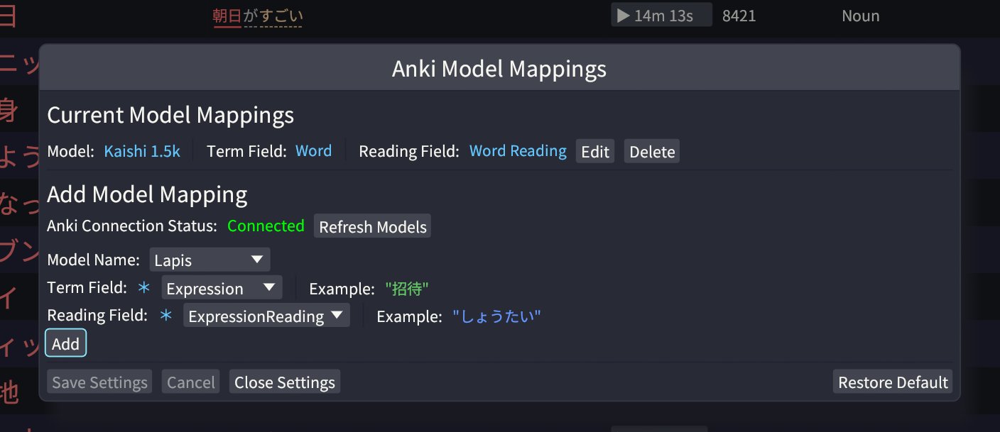

<p align="center">
    
</p>

<div align="center"> 

[](https://github.com/mcgrizzz/Yomine/actions/workflows/test.yml)
[](https://github.com/mcgrizzz/Yomine/releases)
[](https://github.com/mcgrizzz/Yomine?tab=Apache-2.0-1-ov-file)
[](https://github.com/mcgrizzz/Yomine?tab=MIT-2-ov-file)

</div>

# Yomine

### **A Japanese vocabulary mining tool** for extracting the most useful words from real content.
It analyzes subtitle files, integrates with **ASBPlayer**/**MPV** for direct video navigation, provides **flexible ranking and filtering**, and automatically hides words you already know using **Anki**.

Written in Rust 🦀

<div align="center">
    


</div>

---

## Status

🚧 **This project is under active development and may be buggy.**  
The macOS and Linux binaries have not been extensively tested.

## Quick Start

1. **Download** the latest release for your platform from [Releases](https://github.com/mcgrizzz/Yomine/releases)
2. **Connect to Anki** - [Anki Setup](#setting-up-anki-integration)
3. **Connect to a Video Player** - Either:
   - **ASBPlayer**: In ASBPlayer, `MISC` -> `Enable WebSocket client`
   - **MPV**: Start MPV with `--input-ipc-server=/tmp/mpv-socket`

That's it! Yomine will segment the text, rank terms by frequency, and show you vocabulary and expressions to learn.

## Features

- **Vocabulary extraction** from Japanese subtitle files (words and expressions)
- **Frequency-based ranking** to prioritize terms
- **Anki integration** to filter out words you already know
- **Video player integration** (ASBPlayer and MPV) for timestamp navigation
- **Term analysis** with readings, part-of-speech, and context sentences
- **Multi-sentence browsing** to see multiple example sentences per term
- **Ignore list** to hide unwanted terms from your mining results
- **Comprehensibility scoring** - Sentence difficulty estimation based on your Anki card intervals
- **Advanced filtering** - Filter vocabulary by part-of-speech and frequency ranges
- **Dictionary weighting** - Customize which frequency sources are prioritized
- **Sorting and searching** - Sort by frequency, chronological order, sentence count, or comprehension level; search for specific terms
- **Multiple subtitle formats** - Supports SRT, ASS, and SSA subtitle files
- **One-click mining** - Create Anki cards straight from the table, rendered with your own Yomitan templates
- **Batch mining** - Multi-select rows and mine a whole queue at once, resolving shared-sentence conflicts along the way
- **JLPT tags and filtering** - Terms are tagged by JLPT level, with quick level filters in the table
- **Knowledge underlines** - Colors sentence words by your Anki knowledge state, with per-state toggles
- **Yomitan definitions** - Shift+Hover a term for a Yomitan definition popover you can also mine from
- **Frequency Analyzer Tool** - Generate your own frequency dictionaries.
    - Here's one I generated from around 5000 files: [Anilist Top 500](https://github.com/user-attachments/files/23733337/Anilist.Top.500.zip)

## Installation


### Download Installer (Recommended)

1. Go to [Releases](https://github.com/mcgrizzz/Yomine/releases)
2. Download the installer for your system:
   - **Windows**: `Yomine_*_x64-setup.exe`
   - **macOS**: `Yomine_*_universal.dmg` (Intel & Apple Silicon)
   - **Linux**: `Yomine_*.AppImage`, `.deb`, or `.rpm`
3. Install and run — Yomine checks for updates on launch and can update itself in-app

> **macOS note**: the app isn't notarized yet. If macOS refuses to open it, run `xattr -cr /Applications/Yomine.app`.

## Configuration

### Setting Up Frequency Dictionaries

Yomine uses frequency dictionaries to rank vocabulary by importance and improve text segmentation. It will automatically download **[JPDB v2.2 Frequency Kana](https://github.com/Kuuuube/yomitan-dictionaries/?tab=readme-ov-file#jpdb-v22-frequency-kana-recommended)**. Though you can add as many as you like, toggle and weigh them however you like. 

**Adding Dictionaries:**
1. In Yomine, go to **Mining → Frequency Dictionaries**
2. Install a recommended dictionary, or use **Import from file…** to add zip files containing Yomitan-compatible frequency dictionaries
3. Enable, weight, update, or remove dictionaries from the same dialog

**Recommended Dictionaries:**
- **[JPDB v2.2 Frequency Kana](https://github.com/Kuuuube/yomitan-dictionaries/?tab=readme-ov-file#jpdb-v22-frequency-kana-recommended)**: **★ Automagically downloaded and installed ★**
- **[BCCWJ](https://github.com/Kuuuube/yomitan-dictionaries/?tab=readme-ov-file#bccwj-suw-luw-combined)**: Based on the Balanced Corpus of Contemporary Written Japanese
- **[CC100](https://drive.google.com/file/d/1_AYh1VtCq0cj1hXtFO15zRuPUUhUCSHD/view?usp=sharing)**: List from Common Crawl data

More dictionaries: [Marv's collection](https://drive.google.com/drive/folders/1xURpMJN7HTtSLuVs9ZtIbE7MDRCdoU29) and [Shoui's collection](https://drive.google.com/drive/folders/1g1drkFzokc8KNpsPHoRmDJ4OtMTWFuXi)

**Generate Your Own:**

You can also generate your own custom frequency dictionaries directly inside Yomine using the built-in **Frequency Analyzer** tool.

**Note**: Always download frequency dictionaries from trusted sources to avoid corrupted or malicious files. If you can't find a specific dictionary, consider generating your own. You may want to ask around on the [TMW Discord](https://learnjapanese.moe/join/) as well.

### Setting Up Anki Integration

Yomine connects to Anki to filter out terms you already know.

**Prerequisites:**
1. Install the [AnkiConnect](https://ankiweb.net/shared/info/2055492159) add-on in Anki
   - In Anki: Tools → Add-ons → Get Add-ons → Enter code `2055492159`
   - Restart Anki

**Configuration:**
1. In Yomine: Settings → Anki
2. Wait for connection to establish
3. For each note type:
   - Select from dropdown
   - Choose **Term Field** (Japanese word/phrase)
   - Choose **Reading Field** (pronunciation)
   - Click "Add" to save mapping
   
   *Note: Yomine will try to guess the correct fields for you*



### **Configuring WebSocket Connection**

Yomine uses WebSocket to communicate with ASBPlayer for timestamp navigation.

**Default Setup:**
- Yomine runs WebSocket server on port `8766`
- In ASBPlayer: `MISC` → `Enabled WebSocket Client`

**Changing the Port:**

1. In Yomine: Settings → WebSocket Server
2. Change the port to something else (8767, 8768, 1111, 5353, etc)
3. Click "Save and Restart Server"
4. In ASBPlayer: `MISC` → `WebSocket Server URL` → enter `ws://localhost:YOUR_PORT`

### **MPV Player Integration**

Yomine can also integrate directly with MPV player for timestamp navigation, providing an alternative to ASBPlayer.

**Setup:**
1. Start MPV with IPC server enabled:
   ```bash
   mpv --input-ipc-server=/tmp/mpv-socket your-video-file.mkv
   ```

2. Yomine will automatically detect when MPV is running and switch to MPV mode
3. When MPV is detected, the WebSocket server will be automatically stopped
4. When MPV is closed, Yomine will automatically restart the WebSocket server for ASBPlayer

**Note:** You can add `input-ipc-server=/tmp/mpv-socket` to your MPV configuration file to enable IPC by default.

### **One-Click Mining**

Click the ⛏ button next to any term to create an Anki card from the displayed sentence. Card content (definitions, readings, audio) is rendered with your own Yomitan templates, so cards look exactly like the ones you mine with Yomitan directly. The button appears once Yomine detects the Yomitan API.

**Setup:**
1. Install [yomitan-api](https://github.com/yomidevs/yomitan-api) (Yomitan's native messaging companion) and enable **Enable Yomitan API** in Yomitan's General settings
2. Make sure Yomitan has an Anki card format configured (Yomitan Settings → Anki)
3. Optional, for video sessions loaded from asbplayer: configure asbplayer's Anki settings with the **same note type** as Yomitan — mining then goes through asbplayer, which adds sentence audio and a screenshot

Terms that already have a recently-added Anki card show a green ⛏ mined chip instead of the button — including cards you mine directly with Yomitan while watching. Sentences Yomine itself mined are remembered and flagged with "✓ sentence mined" when you see them again. To also flag sentences from cards created outside Yomine, map an optional **Sentence field** in Settings → Anki.

**Quick definition:** hold **Shift** while hovering a term to open a Yomitan definition popover (reading, frequency, and definition), which also has a **+ Mine** button. Scale it under **Settings → Appearance**.

### **Batch Mining**

To mine several terms at once, select rows with their checkboxes (or the header checkbox to select all), then click **Mine N** in the selection bar. Yomine mines the queue one card at a time in timestamp order; you can cancel between cards, and failures are collected without stopping the run. When selected terms share a sentence, a conflict dialog asks you to pick the winning term for that sentence first. Selection and batch mining require both Anki and Yomitan to be connected.

### **Managing Your Ignore List**

The ignore list lets you hide terms you don't want to see from your mining results.

**Adding Terms to Ignore List:**
1. Right-click any term in the main vocabulary table
2. Select "Add to Ignore List"
3. The term will be hidden from future mining sessions

**Managing the Ignore List:**
1. Go to Mining → Ignore List
2. View all ignored terms in the list
3. Remove terms by clicking the red "x"; you can also import or export the list here

## **Roadmap**

### Completed
- [x] **Anki Integration Customization**
- [x] **Prebuilt Binaries**
- [x] **Multi-Sentence Browsing** - View multiple example sentences per term
- [x] **Ignore List** - Hide unwanted terms from mining results
- [x] **Comprehensibility Scoring** - Sentence difficulty estimation based on Anki intervals
- [x] **Advanced Filtering** - Filter by part-of-speech, frequency ranges, and JLPT level
- [x] **Custom Frequency Lists**: Generate dictionaries from your own content
- [x] **One-Click & Batch Mining** - Mine single terms or multi-select queues with your Yomitan templates
- [x] **Knowledge Underlines** - Color sentence words by Anki knowledge state
- [x] **Improved Segmentation** - Tokenizer overhaul for better parsing and matching

### Planned
- [ ] **More File Types**: Support for eBooks, web pages, etc.


## FAQ

**What is vocabulary mining?** 

It's the process of extracting unknown words and expressions from native content (videos, books, etc.) to create targeted study materials. This approach focuses on vocabulary that's relevant to content you want to understand, rather than studying random word lists.

**How should I use this tool?** 

I prefer **post-input mining**: after watching a video or episode, I add it to a todo list. Then, whenever I have time, I can review the content and extract terms I want to add to my Anki mining deck. This helps me stay focused on enjoying the content while watching, knowing I can come back to mine vocabulary later.

**Yomine?** 

The name comes from 読み ("yomi" for reading) + "mine" (as in mining vocabulary).

## Building from Source

**Prerequisites**: 
- [Rust](https://www.rust-lang.org/tools/install) with Cargo
- [Node.js](https://nodejs.org/) 22+ with [pnpm](https://pnpm.io/)
- [Tauri prerequisites](https://tauri.app/start/prerequisites/) for your platform

**Steps:**
```bash
git clone https://github.com/mcgrizzz/Yomine.git
cd Yomine/src-tauri/ui
pnpm install
cd ..
cargo tauri dev    # or: cargo tauri build
```

## License

Yomine is licensed under [MIT](LICENSE-MIT) OR [Apache-2.0](LICENSE-APACHE)

**Author and maintainer:** [@mcgrizzz](https://github.com/mcgrizzz)

**Key Dependencies:**
* [Vibrato](https://github.com/daac-tools/vibrato) for text segmentation - [MIT](https://github.com/daac-tools/vibrato/blob/main/LICENSE-MIT) or [Apache-2.0](https://github.com/daac-tools/vibrato/blob/main/LICENSE-APACHE)
* [Tauri](https://tauri.app/) + [Svelte](https://svelte.dev/) for the user interface - [MIT](https://github.com/tauri-apps/tauri/blob/dev/LICENSE_MIT) or [Apache-2.0](https://github.com/tauri-apps/tauri/blob/dev/LICENSE_APACHE-2.0)
* [WanaKana Rust](https://github.com/PSeitz/wana_kana_rust) for Japanese text utilities - [MIT](https://github.com/PSeitz/wana_kana_rust/blob/master/LICENSE)
* [jp-deinflector](https://github.com/btrkeks/jp-deinflector) for Japanese deinflection
* Noto Sans/Serif JP fonts - [SIL Open Font License](https://openfontlicense.org/open-font-license-official-text/)
  * Thanks to https://github.com/r-40021/noto-sans-jp for the converted font without intersection issues.

**Data Sources:**
* JLPT N5–N1 vocabulary data is derived from [coolmule0/JLPT-N5-N1-Japanese-Vocabulary-Anki](https://github.com/coolmule0/JLPT-N5-N1-Japanese-Vocabulary-Anki/), which is based on [Jonathan Waller's JLPT resources](https://www.tanos.co.uk/jlpt/).

---

Happy Mining! ⛏️ 頑張りましょう！
